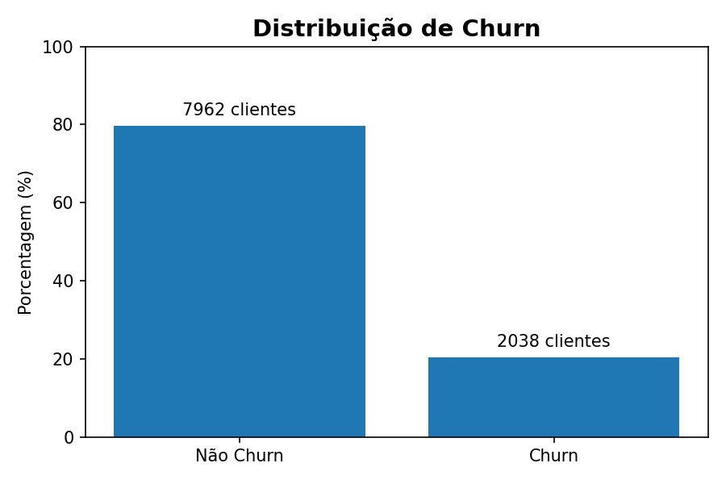

# 📉 EDA-Churn-Predict — Customer Churn Analysis & Prediction

Projeto completo de **Análise de Dados + Ciência de Dados**, com foco em:

- Exploração e entendimento dos dados
- Construção de modelos preditivos
- Explicabilidade das predições com SHAP
- Aplicação interativa com Streamlit
- Rastreio de experimentos com MLflow

O projeto foi desenvolvido para atender tanto **análises exploratórias em notebooks** quanto uma **estrutura modular em Python**, mais próxima de um ambiente de produção.

---

## 🧠 Contexto do Problema

Churn (evasão de clientes) é um dos principais desafios em empresas de serviços e produtos recorrentes, pois:

- Impacta diretamente a receita
- Indica problemas de satisfação ou engajamento
- Possui efeito acumulativo negativo ao longo do tempo

Este projeto busca responder à pergunta:

> **Quais clientes possuem maior probabilidade de churn e quais fatores explicam esse risco?**

## 📊 Visão Geral dos Dados

Antes da construção dos modelos, foi realizada uma Análise Exploratória de Dados (EDA) com o objetivo de entender a distribuição da variável alvo e o comportamento geral da base.

O gráfico abaixo apresenta a distribuição da variável Exited (Churn), evidenciando um desbalanceamento natural do problema — cenário comum em casos reais de churn, onde a maioria dos clientes permanece ativa.



Esse desbalanceamento foi um fator determinante para a escolha do Recall como métrica principal, priorizando a identificação de clientes com maior risco de saída, mesmo ao custo de alguns falsos positivos.

## 🧰 Principais Bibliotecas Utilizadas

- pandas — manipulação de dados

- matplotlib, seaborn — visualização

- scikit-learn — pipelines e modelagem

- xgboost — algoritmos de boosting

- shap — explicabilidade de modelos

- mlflow — rastreamento de experimentos

- streamlit — aplicação interativa
---

## 📂 Estrutura do Repositório

```text
EDA-Churn-Predict/
│
├── notebooks/                # Análises exploratórias e modelagem
│   ├── eda.ipynb             # Análise Exploratória de Dados (EDA)
│   ├── model.ipynb           # Modelagem, tuning e MLflow
│
├── data/                   # Dataset do projeto
│    └── Customer-Churn-Records.csv
├── models/                   # Arquivo com o modelo de ML
│    └── model.pkl
│
├── streamlit/                # Aplicação interativa
│   ├── app.py                # App Streamlit
│   ├── data.py               # Carregamento de dados e baseline
│   ├── churnmodel.py         # Serviço de predição e risco
│   ├── shapservice.py        # Explicabilidade com SHAP
│   └── recomendar.py         # Regras de recomendação
│
├── modeling/                 # Criação do modelo de ML
│    └── modeling.py
│      
├── transform/                # Pré-processamento utilizado no pipeline
│   └── preprocessing.py
│
├── performance/              # Gráficos e análises complementares
│    └── performance.py
│               
├── main.py                   # Execução de treino e experimentos
├── predict.py                # Carregamento dos modelos treinados
├── requirements.txt          # Dependências do projeto
└── README.md

```
## 🤖 Modelagem de Machine Learning

A modelagem está concentrada em:

- 📁 `notebooks/model.ipynb`
- 📁 `modeling/modeling.py`

### Principais etapas

- Pipeline de pré-processamento das variáveis
- Teste de múltiplos algoritmos com otimização de hiperparâmetros com `GridSearchCV`
- Analise de performance
- Rastreamento de experimentos com **MLflow**

### 📌 Por que Recall?

Em problemas de churn, o custo de **não identificar um cliente que irá sair (falso negativo)** é significativamente maior do que o custo de uma ação preventiva aplicada a um cliente que não sairia (falso positivo).  
Por isso, o Recall é priorizado como métrica principal.

---

## 🔎 Explicabilidade com SHAP

A interpretabilidade é tratada como parte essencial do projeto.

- 📁 `streamlit/shapservice.py`

O SHAP é utilizado para:

- Explicações locais por cliente
- Ranking das features mais impactantes
- Identificação de fatores que aumentam ou reduzem o risco de churn

Isso permite responder claramente à pergunta:

> **Por que este cliente específico está em risco?**

---

## 🖥️ Aplicação Interativa — Streamlit

A aplicação interativa permite:

- Inserção manual dos dados de um cliente
- Visualização da probabilidade de churn
- Comparação com a média da base
- Posicionamento do cliente em relação aos demais (percentil de risco)
- Explicação dos principais fatores de risco
- Geração de recomendações comerciais acionáveis

- 📁 `streamlit/app.py`

---

## 🚀 Como Executar o Projeto Localmente

### 1️⃣ Instalar dependências
```bash
pip install -r requirements.txt
```
### 2️⃣ Iniciar o MLflow
```bash
mlflow ui
```
Acesse: http://localhost:5000

### 3️⃣ Executar o pipeline de modelagem
```bash
python main.py
```
### 4️⃣ Rodar a aplicação Streamlit
```bash
cd streamlit
```
```bash
streamlit run app.py
```
## 🎯 Conclusões

Este projeto demonstra a aplicação completa de **Análise de Dados aliada à Ciência de Dados**, indo além da construção de modelos para focar em **entendimento do problema e tomada de decisão de negócio**.

Ao longo do projeto, foi possível:

- Compreender o comportamento de churn por meio de uma **Análise Exploratória estruturada**
- Identificar padrões relevantes em variáveis demográficas, comportamentais e financeiras
- Construir pipelines de Machine Learning reproduzíveis e rastreáveis
- Priorizar métricas alinhadas ao contexto de negócio (Recall)
- Tornar modelos complexos **interpretáveis** com SHAP
- Traduzir previsões em **recomendações comerciais acionáveis**

O resultado final é uma solução que não apenas prevê churn, mas **explica o risco e apoia decisões estratégicas**, aproximando a modelagem estatística de um cenário real de aplicação empresarial.
